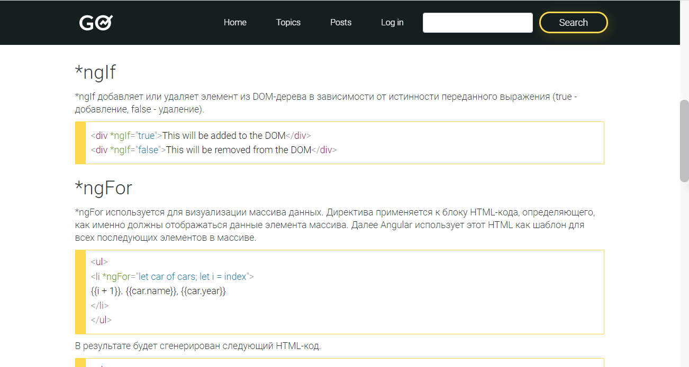
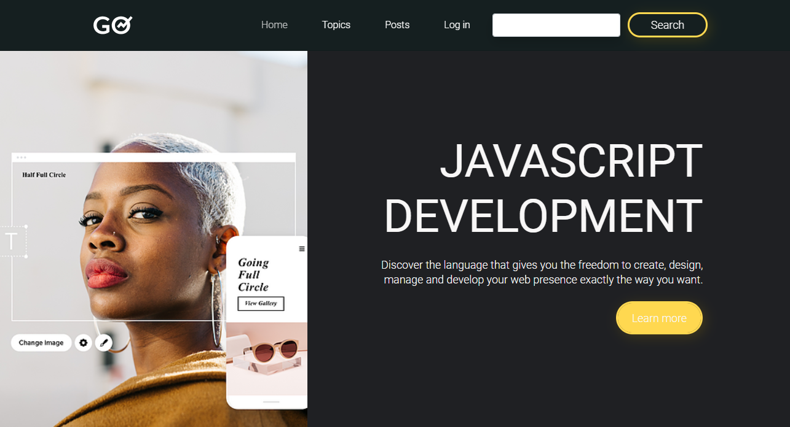

# JavaScript blog
I have decided to develop the app where I have an opportunity to publish my posts related to js development. Techonologies, which I am using, is `Angular, TS, Webpack, NodeJS`

> 
> 

## How to run the app
* `npm install`
*  modify the file, named `server\mysql\connection_mysql.ts`. Fill out your database connection settings
* `npm run webpack` 
* `npm run server`
* `npm run start`

## Rest Api
* GET / - home page
* GET /posts - posts
* GET /post/:postid -  the specific post
* GET /createpost - the page, where admin can create posts. By the way, you need to log in to get accessed to this feature. Password and email of admin are available in the file, named server\admin.ts
* GET /login - the page, where admin can log in
* GET /topics - the page, where user can see posts related to react and angular

### ! Warning. The app is under development.
